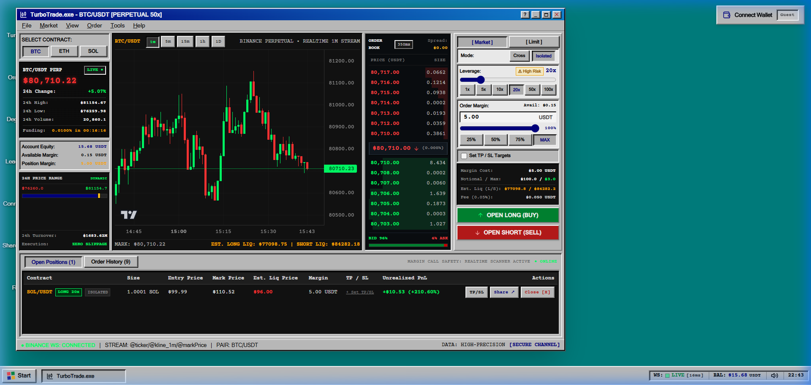
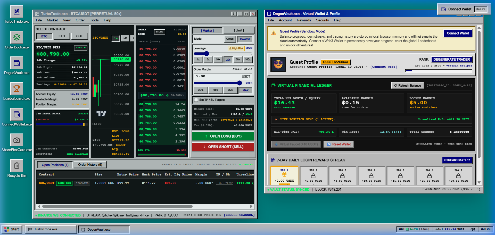
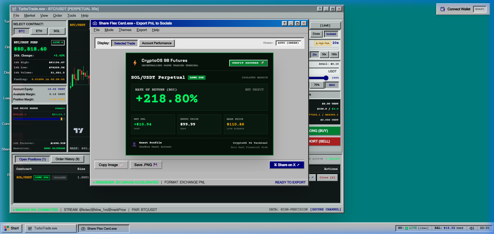

# CryptoOS 98

> High-Performance Web3 Perpetual Futures Trading Simulator in an Authentic Windows 98 Desktop Environment.

CryptoOS 98 is a zero-financial-risk cryptocurrency perpetual futures paper trading terminal. It couples institutional-grade derivatives simulation math and real-time Binance market feeds with an interactive, pixel-accurate late-1990s desktop operating system.

---

## Visual Overview

### 1. TurboTrade.exe — Main Derivatives Terminal
Real-time candlestick charts with 300-tick historical depth, live Level-2 order book, margin & leverage controls (up to 100x), and order execution engine.



### 2. Multi-Window Retro Desktop Workspace
Movable window manager supporting concurrent applications: TurboTrade, DegenVault (portfolio ledger and faucet), Leaderboard, and Start Menu.



### 3. ShareFlexCard.exe — Direct PnL Export to Socials
Integrated 2D canvas generator producing authentic CRT-themed trade performance cards ready for clipboard export and sharing on X / Twitter.



---

## Project Overview

### What is CryptoOS 98?
Trading cryptocurrency perpetual contracts involves complex mechanics: dynamic funding rates, maintenance margin requirements, non-linear liquidation thresholds, and rapid order book volatility. Most beginners lose capital while learning these mechanics on live exchanges.

CryptoOS 98 solves this by providing an exact, zero-risk simulation sandbox. It mirrors the exact mechanics of Tier-1 crypto derivatives exchanges (Binance, Bybit, Gate.io) while packaging the experience into a nostalgic Windows 98 operating system complete with window management, procedural sound effects, and gamified leaderboards.

### Who is it for?
- **Traders:** Practice leverage strategies, test stop-loss execution, and understand liquidation risk under real market volatility without risking capital.
- **Web3 Communities & DAOs:** Host zero-risk paper trading competitions, leaderboard sprints, and onboarding campaigns.
- **Engineers & Evaluators:** An open-source reference implementation of high-throughput WebSocket data batching, deterministic financial math, and retro skeuomorphic UI engineering in modern React and TypeScript.

---

## System Architecture

CryptoOS 98 operates on a decoupled client-side architecture divided into four primary layers:

```
┌────────────────────────────────────────────────────────────────────────┐
│                        WINDOWS 98 DESKTOP UI                           │
│  Window Manager │ Taskbar & Tray │ TurboTrade │ DegenVault │ Modals   │
└───────────────────────────────────┬────────────────────────────────────┘
                                    │
┌───────────────────────────────────▼────────────────────────────────────┐
│                    STATE & RISK MANAGEMENT (ZUSTAND)                   │
│  useTradingStore │ useMarketDataStore │ useWalletStore │ useWindowStore │
└───────────────┬────────────────────────────────────────┬───────────────┘
                │                                        │
┌───────────────▼────────────────┐      ┌────────────────▼───────────────┐
│     FINANCIAL SIMULATION       │      │     BINANCE WEBSOCKET GATEWAY  │
│  - Margin & Liquidation Math   │      │  - Multi-stream Multiplexing   │
│  - Reactive Liquidation Engine │      │  - Adaptive Tick Batching      │
│  - Funding Rate Settlement     │      │  - Failover REST Hydration     │
└────────────────────────────────┘      └────────────────────────────────┘
```

### 1. Real-Time Data Pipeline (Binance WebSocket Gateway)
- **Multi-Stream Multiplexing:** Ingests live Binance Futures feeds (`<symbol>@ticker`, `<symbol>@kline_<interval>`, `<symbol>@markPrice@1s`, `<symbol>@depth20@100ms`) through a unified connection manager.
- **Tick Batching & Throttling:** Rapid price ticks are buffered and dispatched using `requestAnimationFrame` to maintain smooth 60fps rendering without UI thread contention.
- **Multi-Endpoint Failover:** Automatically handles connection drops with exponential backoff and dual-endpoint redundancy (`binance.com` and `binancevision.com`).

### 2. Financial Simulation & Risk Engine
- **Deterministic Math:** Pure mathematical calculations for Notional Value, Margin Requirements, Unrealized/Realized PnL, ROE %, and exact Liquidation Prices.
- **Dual Margin Modes:** Supports both **Isolated Margin** (risk quarantined to specific contract) and **Cross Margin** (aggregate account equity collateralizing all active positions).
- **Automated TP/SL Engine:** Real-time background scanner that monitors mark price fluctuations and triggers automatic Take Profit or Stop Loss market closes when user-defined price barriers are touched.
- **Funding Rate Settlement Clock:** Simulates standard 8-hour funding intervals, adjusting position balances based on perpetual premium indices.

### 3. Reactive Liquidation Scanner
- A high-frequency portfolio evaluation loop monitors live mark prices against the calculated liquidation boundary ($P_{\text{liq}}$).
- If mark price breaches $P_{\text{liq}}$, the engine immediately liquidates the position, records the bankruptcy event in the ledger, triggers an authentic Windows 98 Critical Error dialog, and provides access to an emergency faucet.

### 4. Skeuomorphic OS & Audio Engine
- **Windows 98 Design System:** Handcrafted CSS tokens replicating authentic Windows 98 bevels (`.win-outset`, `.win-inset`, `.win-inset-deep`), system typography (`MS Sans Serif`), titlebar gradients, and draggable window boundaries.
- **Procedural Web Audio API:** Zero external audio assets. Mechanical clicks, alert beeps, order execution sounds, and CRT degauss effects are generated purely through code using native browser oscillators and gain nodes.
- **Cryptographic Anti-Tamper Security:** Position and balance data stored in browser storage are canonicalized and protected with a SHA-256 HMAC checksum. Unauthorized state modifications trigger an interactive Windows 98 Blue Screen of Death (BSOD) system recovery screen.

---

## Core Mathematical Models

All trading calculations in CryptoOS 98 use institutional formulas matching industry standards:

### 1. Position Sizing & Exposure
$$\text{Notional Value } (V) = \text{Initial Margin } (IM) \times \text{Leverage } (L)$$
$$\text{Contract Quantity } (Q) = \frac{V}{P_{\text{entry}}}$$

### 2. Unrealized Profit & Loss (uPnL)
$$\text{Long: } uPnL = Q \times (P_{\text{mark}} - P_{\text{entry}})$$
$$\text{Short: } uPnL = Q \times (P_{\text{entry}} - P_{\text{mark}})$$
$$\text{Return on Equity (ROE \%)} = \frac{uPnL}{IM} \times 100$$

### 3. Liquidation Price ($P_{\text{liq}}$)
Incorporates Maintenance Margin Rate ($MMR$) and standard exchange taker fee rate ($F_{\text{taker}} = 0.05\%$):

$$\text{Isolated Long: } P_{\text{liq}} = \frac{P_{\text{entry}} \times Q - IM}{Q \times (1 - MMR - F_{\text{taker}})}$$

$$\text{Isolated Short: } P_{\text{liq}} = \frac{P_{\text{entry}} \times Q + IM}{Q \times (1 + MMR + F_{\text{taker}})}$$

$$\text{Cross Margin: Evaluates aggregate portfolio equity against } \sum (Q_i \times P_{\text{mark},i} \times MMR_i)$$

---

## Feature Modules

| Module | Application | Description |
|---|---|---|
| **TurboTrade** | `TurboTrade.exe` | Main futures terminal featuring contract selection (`BTC`, `ETH`, `SOL`), TradingView chart with 300 historical candles, live Level-2 order book with symmetric depth, leverage slider (1x-100x), and active positions table. |
| **DegenVault** | `DegenVault.exe` | Account balance overview, net worth breakdown, performance analytics (Win Rate, Total Trades, All-time ROI), emergency virtual faucet (+10 USDT), and 7-day retention login streak rewards. |
| **OrderBook** | `OrderBook.exe` | Standalone high-density depth ladder with real-time bid/ask pressure visualization and dynamic spread readout. |
| **Leaderboard** | `Leaderboard.exe` | Global competitive trader rankings categorized by PnL and ROI, supporting simulated competitors and synchronized Web3 wallet scores. |
| **ShareFlexCard** | `ShareFlexCard.exe` | Trade brag modal rendering customizable retro CRT PnL summary cards for social sharing. |
| **Web3 Connector** | `ConnectWallet.exe` | Web3 authentication supporting MetaMask, Coinbase Wallet, and WalletConnect via clean EIP-6963 discovery. |

---

## Tech Stack

- **Frontend Core:** React 18, TypeScript (Strict Mode)
- **Build System:** Vite 5
- **Styling Architecture:** Tailwind CSS v3 (custom retro palette, zero-radius tokens, optical bevel classes)
- **State Management:** Zustand 4 with custom SHA-256 persistence middleware
- **Financial Charting:** TradingView Lightweight Charts (v5)
- **Real-time Networking:** Native WebSockets connected to Binance Futures public streams
- **Sound Synthesis:** Native Web Audio API (procedural frequency oscillators)
- **Graphics Export:** HTML5 Canvas / `html-to-image`
- **Testing:** Vitest 2.1 (comprehensive unit test coverage across math, liquidation, and wallet stores)

---

## Getting Started

### Prerequisites
- **Node.js**: `v18.0.0` or higher
- **npm**: `v9.0.0` or higher

### Installation

```bash
# 1. Clone repository
git clone https://github.com/cybort18/Trading-Simulator-game.git
cd Trading-Simulator-game

# 2. Install dependencies
npm install

# 3. Start local development server
npm run dev
```

The application will be available at `http://localhost:3000/`.

### Running Tests

Execute the automated unit test suite:
```bash
npm test
```

### Production Build

Create an optimized static distribution:
```bash
npm run build
```
Built assets will be placed in the `dist/` directory, ready for deployment to any static hosting provider (Vercel, Cloudflare Pages, Netlify, or Docker).

---

## Project Structure

```
Trading-Simulator-game/
├── docs/
│   └── screenshots/              # High-resolution application screenshots
├── public/                       # Static public assets (icons, manifests)
├── src/
│   ├── components/
│   │   ├── common/               # Pixel icons, retro buttons, bevels
│   │   ├── desktop/              # Canvas, draggable WindowFrame, Taskbar, StartMenu
│   │   ├── modals/               # WelcomeModal, LiquidationModal, BSODModal
│   │   ├── trading/              # TradingView Lightweight Charts & CRT wrappers
│   │   └── windows/              # TurboTrade, DegenVault, Leaderboard, ShareCard
│   ├── services/
│   │   ├── BinanceWsService.ts   # WebSocket feed manager & tick aggregator
│   │   ├── LiquidationEngine.ts  # Real-time portfolio liquidation watcher
│   │   ├── FundingRateEngine.ts  # 8-hour funding rate calculation clock
│   │   ├── DailyClaimManager.ts  # Daily rewards and streak retention logic
│   │   ├── SoundFXService.ts     # Web Audio API sound synthesizer
│   │   └── Web3AuthService.ts    # EIP-6963 wallet connection handler
│   ├── stores/
│   │   ├── useMarketDataStore.ts # Live tickers, mark prices, and candle store
│   │   ├── useTradingStore.ts    # Position records, orders, and ledger
│   │   ├── useWalletStore.ts     # Collateral balance, margin, and faucet state
│   │   └── useWindowStore.ts     # Desktop window coordinates, focus, and z-index
│   └── utils/
│       ├── simulationMath.ts     # Pure deterministic perpetual futures formulas
│       ├── security.ts           # SHA-256 state hashing and tamper detection
│       └── safeStorage.ts        # Fault-tolerant storage adapter
├── ARCHITECTURE.md               # Deep-dive architectural specification
├── PRD.md                        # Product requirements document
└── SIMULATION_ENGINE.md          # Complete mathematical & liquidation spec
```

---

## Disclaimer

CryptoOS 98 is a paper trading simulator created strictly for educational and entertainment purposes. All trades, margins, balances, and PnL metrics within the platform are simulated and involve **zero real financial capital or cryptocurrency holdings**.

---

## License

This project is licensed under the MIT License.
